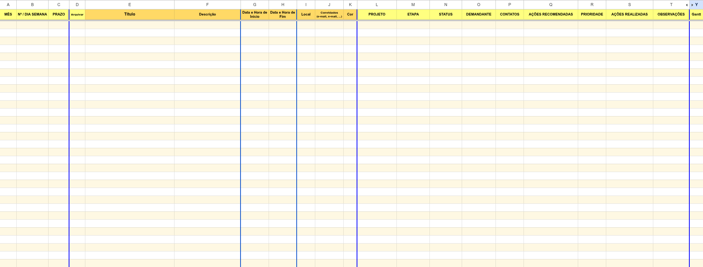
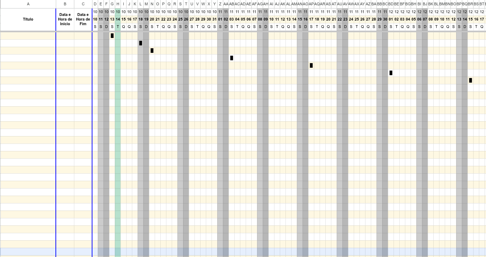
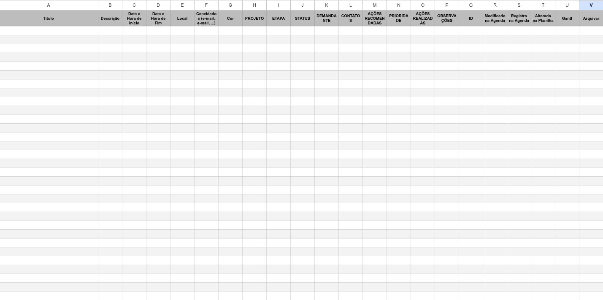
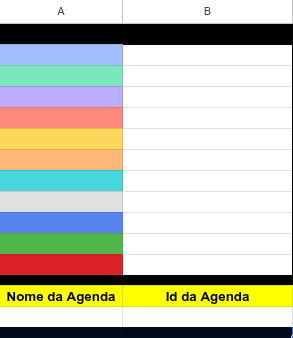

# 🧭 MATRIZ DE GERENCIAMENTO DE PROJETOS  
### Sincronização Bidirecional com Agenda Online — **Versão 8.7 (16/09/2025)**

---

  
  
  
  
  
  

---

## 🧩 Descrição Geral

A **Matriz de Gerenciamento de Projetos** é um sistema desenvolvido em **JavaScript / Google Apps Script** para automatizar a integração entre **Google Planilhas** e **Google Agenda**, permitindo a **sincronização bidirecional de eventos**, **gerenciamento de tarefas e prazos**, e **visualização dinâmica no formato de gráfico de Gantt**.

Voltado para contextos de **administração pública, pesquisa e inovação**, o código cria e mantém automaticamente uma matriz de controle de projetos, otimizando o acompanhamento das etapas e a gestão de portfólios institucionais.

---

## ⚙️ Informações Técnicas

| Categoria | Detalhe |
|------------|----------|
| **Versão** | 8.7 — 16/09/2025 |
| **Linguagem** | JavaScript / Google Apps Script |
| **Campo de Aplicação (INPI)** | Administração — Código: **AD04-Adm Publ** |
| **Tipo de Programa (INPI)** | Planilhas Eletrônicas — Código: **FA03-Planil Elet** |

---

## 👥 Autores

| Nome | Instituição | ORCID |
|------|--------------|--------|
| **Victor Gianordoli** | Instituto Federal do Espírito Santo (IFES) | [0000-0001-5905-0641](https://orcid.org/0000-0001-5905-0641) |
| **Taciana de Lemos Dias** | Universidade Federal do Espírito Santo (UFES) | [0000-0002-7172-1230](https://orcid.org/0000-0002-7172-1230) |

---

## 🧮 Pré-requisitos

O sistema opera em uma planilha Google contendo as seguintes **abas obrigatórias**:  
`AGENDA`, `GANTT`, `ARQUIVO` e `ID`.

Atenção:  
- Os nomes das abas são **case sensitive** e não devem ser alterados.  
- As colunas de datas devem estar no **formato numérico de data/hora**.  
- A ordem das abas deve ser mantida.

---

### 📋 Aba `AGENDA`

| Colunas obrigatórias |
|-----------------------|
| MÊS |
| Nº / DIA SEMANA |
| PRAZO |
| Arquivar |
| Título |
| Descrição |
| Data e Hora de Início |
| Data e Hora de Fim |
| Local |
| Convidados (e-mail, e-mail, ...) |
| Cor |
| PROJETO |
| ETAPA |
| STATUS |
| DEMANDANTE |
| CONTATOS |
| AÇÕES RECOMENDADAS |
| PRIORIDADE |
| AÇÕES REALIZADAS |
| OBSERVAÇÕES |
| ID |
| Modificado na Agenda |
| Registro na Agenda |
| Alterado na Planilha |
| Gantt |

---

### 🗓️ Aba `GANTT`

| Colunas obrigatórias |
|-----------------------|
| Título |
| Data e Hora de Início |
| Data e Hora de Fim |

---

### 🗂️ Aba `ARQUIVO`

| Colunas obrigatórias |
|-----------------------|
| Título |
| Descrição |
| Data e Hora de Início |
| Data e Hora de Fim |
| Local |
| Convidados (e-mail, e-mail, ...) |
| Cor |
| PROJETO |
| ETAPA |
| STATUS |
| DEMANDANTE |
| CONTATOS |
| AÇÕES RECOMENDADAS |
| PRIORIDADE |
| AÇÕES REALIZADAS |
| OBSERVAÇÕES |
| ID |
| Modificado na Agenda |
| Registro na Agenda |
| Alterado na Planilha |
| Gantt |
| Arquivar |

---

### 🔑 Aba `ID`

| Célula | Função |
|---------|--------|
| **B17** | Deve conter o **ID da Agenda Google** utilizada para sincronização bidirecional |

---

## 🧠 Observações Importantes

> ⚠️ **Sensibilidade a nomes**  
> Os nomes das abas e colunas devem ser mantidos exatamente conforme especificado acima.

> 🕒 **Formato de data**  
> As colunas de datas devem estar configuradas em formato numérico de data e hora.

> 🧱 **Geração automática de matriz**  
> O código cria uma nova estrutura de planilha automaticamente, caso não exista.

> 📊 **Categorias de controle**  
> O sistema permite a gestão dos seguintes campos:  
> `PROJETO`, `ETAPA`, `STATUS`, `DEMANDANTE`, `CONTATOS`,  
> `AÇÕES RECOMENDADAS`, `PRIORIDADE`, `AÇÕES REALIZADAS`, `OBSERVAÇÕES`.  
>  
> Também gera **visualizações em gráfico de Gantt** para acompanhamento visual dos registros.

---

## 💻 Estrutura de Arquivos

| Arquivo | Descrição |
|----------|------------|
| `matriz_gerenciamento_de_projetos.js` | Código principal em JavaScript (Google Apps Script) |
| `01_tela_AGENDA.png` | Exemplo da aba de Agenda |
| `02_tela_Gantt.png` | Exemplo da visualização Gantt |
| `03_tela_Arquivo.png` | Exemplo da aba de Arquivo |
| `04_tela_ID.png` | Exemplo da aba de ID |

---

## 🖼️ Prévia Visual

| Tela 1 | Tela 2 |
|--------|--------|
|  |  |

| Tela 3 | Tela 4 |
|--------|--------|
|  |  |

---

## 🧾 Licença e Registro

  

Este projeto está licenciado sob a **Creative Commons Atribuição 4.0 Internacional (CC BY 4.0)**.  
Você pode **copiar, redistribuir, remixar, transformar e criar a partir deste material**, para qualquer finalidade, **inclusive comercial**, **desde que cite os autores originais**:

> **Autores:** Victor Gianordoli (IFES) e Taciana de Lemos Dias (UFES)

**É obrigatório atribuir o devido crédito aos autores em qualquer reprodução, modificação ou derivação do código.**

📘 Referência da licença:  
[https://creativecommons.org/licenses/by/4.0/](https://creativecommons.org/licenses/by/4.0/)

📜 Projeto registrado no INPI conforme **Classificação INPI AD04 / FA03**.  
Distribuído com fins de **pesquisa, inovação e extensão acadêmica**.

---

## 🧾 Como Citar Este Projeto

Se você utilizar este software em trabalhos acadêmicos, técnicos ou institucionais, **por favor, cite-o adequadamente**.  
O GitHub gera automaticamente as citações em formato **APA** e **BibTeX** com base no arquivo `CITATION.cff`.

> 🧭 **Para citar:**  
> Clique no menu à direita, em **About → Cite this repository**  
> e copie o formato desejado (APA ou BibTeX).

📘 **Exemplo de citação (APA):**  
> Gianordoli, V., & Dias, T. de L. (2025). *Matriz de Gerenciamento de Projetos com Sincronização Bidirecional com Agenda Online (Versão 8.7)* [Computer software]. IFES/UFES. https://github.com/ObservaGP/matriz_gerenciamento_de_projetos

---

## 📬 Contato

Para dúvidas, colaborações e solicitações de uso institucional:

- 🧑‍🏫 ObservaGP - Grupo de Pesquisa do Observatório de Gestão Pública  
- 🌐 http://dgp.cnpq.br/dgp/espelhogrupo/3101388046828956  

---

